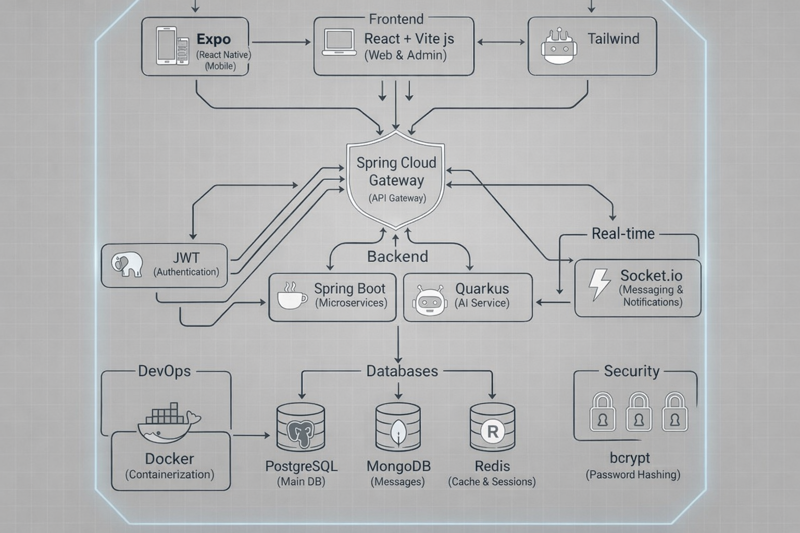
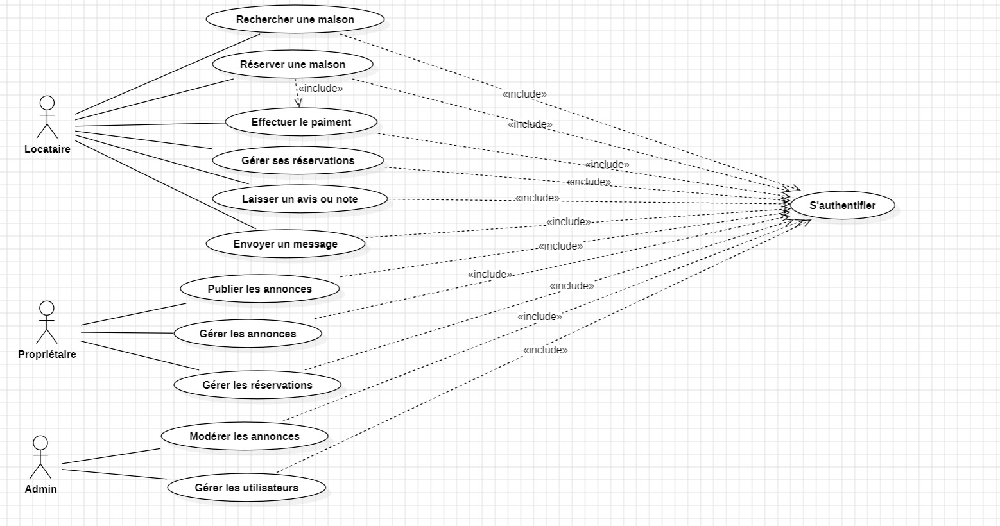

# 🏠 Zanora – Plateforme de Location Intelligente

Zanora est une plateforme intelligente de location de logements permettant aux locataires et propriétaires d'interagir efficacement grâce à une architecture moderne basée sur microservices, IA et temps réel.

---

## 🚀 Vision du Projet

Créer une plateforme sécurisée, intelligente et scalable permettant :

- Recherche avancée de logements
- Estimation intelligente des loyers via IA
- Messagerie en temps réel
- Gestion complète des utilisateurs et rôles
- Système d'avis et de notation
- Modération et validation des annonces

---

## 🏗 Architecture Technique

### 📌 Architecture Globale



### 🔹 Frontend

- 📱 **Expo (React Native)** – Application mobile
- 🌐 **React + Vite.js** – Interface Web & Admin
- 🎨 **Tailwind CSS** – Styling

### 🔹 Backend

- 🌍 **Spring Cloud Gateway** – API Gateway
- ☕ **Spring Boot** – Microservices
- 🤖 **Quarkus** – Service IA (estimation de loyer)
- 🔐 **JWT** – Authentification
- ⚡ **Socket.io** – Messagerie temps réel & notifications

### 🔹 Bases de Données

- 🐘 **PostgreSQL** – Base principale
- 🍃 **MongoDB** – Messages & données flexibles
- ⚡ **Redis** – Cache & sessions

### 🔹 DevOps

- 🐳 **Docker** – Containerisation

### 🔹 Sécurité

- 🔒 **bcrypt** – Hashing des mots de passe
- 🔐 **JWT Authentication** – Authentification sécurisée
- 🛡️ **RBAC** – Gestion des rôles & permissions

---

## 📊 Diagramme de Cas d'Utilisation



### Acteurs principaux

- 👤 **Utilisateur**
- 🏠 **Locataire**
- 🏢 **Propriétaire**
- 🛡 **Administrateur**

---

## 📋 Product Backlog

### 🔥 Release 1

#### Sprint 0

- Création de compte
- Connexion
- Vérification identité propriétaire
- Création / modification / suppression annonce
- Gestion utilisateurs (Admin)
- Gestion rôles & permissions (Admin)
- Validation annonces (Admin)

#### Sprint 1

- Modification profil
- Recherche logements
- Filtrage annonces
- Carte interactive
- Détails annonce
- Messagerie propriétaire
- Notifications
- Modération annonces
- Dashboard statistiques (Admin)

---

### 🚀 Release 2

#### Sprint 2

- Loyer moyen par zone
- Favoris
- Comparaison annonces
- Estimation loyer via IA
- Signalement annonces
- Traitement signalements (Admin)
- Notation propriétaire
- Avis logement
- Consultation avis

---

## 🗂 Structure du Projet

```
zanora/
│
├── backend/
│   ├── gateway/              # Spring Cloud Gateway
│   ├── user-service/         # Gestion utilisateurs & rôles
│   ├── listing-service/      # Gestion annonces
│   ├── messaging-service/    # Socket.io / Messages
│   └── ai-service/           # Service IA (Quarkus)
│
├── frontend/
│   ├── mobile/               # Expo (React Native)
│   └── web-admin/            # React + Vite.js
│
├── datapostgres/             # Scripts & configuration PostgreSQL
│
├── docs/                     # Diagrammes & architecture
│   ├── architecture.png
│   └── use-case.png.jpeg
│
├── scrum_artifacts/          # Backlog, sprint planning, etc.
│
└── README.md
```

---

## ⚙️ Installation & Setup

### 📱 Frontend Mobile (Expo)

```bash
cd frontend/mobile
npm install
npm start
```

Scanner le QR code avec Expo Go.

### 🌐 Frontend Web (Admin)

```bash
cd frontend/web-admin
npm install
npm run dev
```

### 🖥 Backend (Docker)

```bash
cd backend
docker-compose up --build
```

---

## 🔐 Sécurité & Authentification

- **Authentification via JWT** – Tokens sécurisés pour toutes les requêtes
- **Gestion des rôles** – USER, OWNER, ADMIN
- **Validation des annonces** – Avant publication
- **Hash des mots de passe** – Avec bcrypt
- **Contrôle d'accès** – Basé sur les rôles (RBAC)

---

## 🤖 Intelligence Artificielle

Le service IA permet :

- ✅ Estimation automatique du loyer
- 📊 Analyse du marché
- 💡 Suggestions intelligentes futures

**Technologie** : Quarkus + modèle ML

---

## 🔄 Communication Temps Réel

Propulsé par **Socket.io** :

- 📨 Notifications instantanées
- 💬 Messagerie entre locataire et propriétaire
- 🔔 Alertes en temps réel

---

## 📞 Contact & Contribution

Pour toute question ou contribution, n'hésitez pas à ouvrir une issue ou une pull request.

---

## 📄 Licence

Ce projet est sous licence [MIT](LICENSE).

---

**Développé avec ❤️ par l'équipe Zanora**
